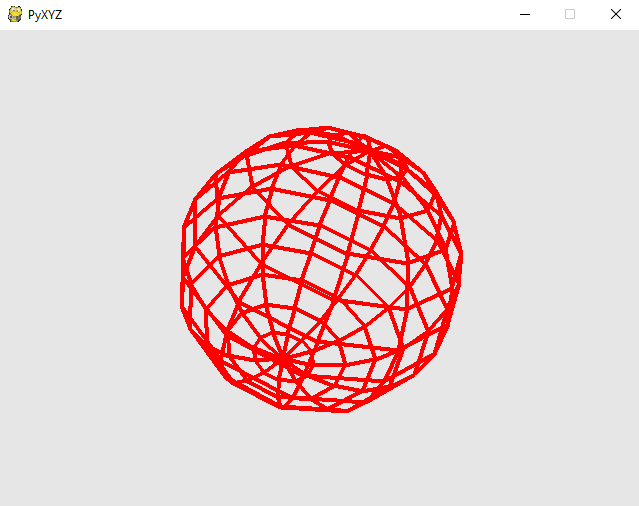

PyXYZ (pronounced pyxies) is a a simple 3D wireframe engine for education, entirely programmed in Python, using only PyGame, NumPy and NumPy-Quaternion.

* Engine: https://github.com/VideojogosLusofona/PyXYZ

* Documentation: https://videojogoslusofona.github.io/PyXYZ/doc/index.html

* Samples: https://github.com/VideojogosLusofona/PyXYZ-Samples
